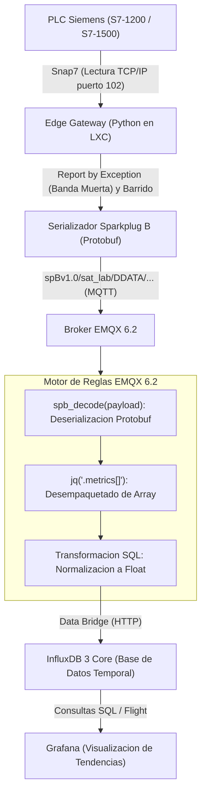

# Edge Gateway Industrial: Siemens PLC a InfluxDB 3 y Grafana via Sparkplug B

Este documento explica de forma detallada, didactica y paso a paso el funcionamiento completo de la arquitectura de telemetria industrial implementada, los cambios realizados en el sistema y como se construyo cada sentencia SQL en el motor de reglas de EMQX 6.2.

---

## 1. Que se hizo en este proyecto

El objetivo fue transformar un lector basico de PLC en un **Edge Gateway Industrial profesional** capaz de transmitir variables fisicas en tiempo real hacia una base de datos de series temporales y visualizarlas en Grafana.

Las acciones realizadas fueron:

1. **Eliminacion de eventos virtuales:** Se removio toda la logica de deteccion de flancos o eventos por software (`EventDetector`), concentrando el 100% de la capacidad del Gateway en la lectura y publicacion de telemetria pura de sensores.
2. **Implementacion de Reporte por Excepcion (Banda Muerta / RBE) y Barrido (Sweep):** 
   - Las variables solo se transmiten si el valor cambia mas alla de un umbral (`deadband`) o si cambia de estado (digitales).
   - Si una variable se mantiene estable y no cambia, se fuerza un envio periodico cada cierto tiempo (`freq`) para certificar que el sensor sigue en linea.
3. **Auditoria Sparkplug B:** Se comprobo con un script suscriptor local (`test_subscriber.py`) que los paquetes binarios viajan correctamente codificados en formato Sparkplug B (Protocol Buffers).
4. **Integracion con EMQX 6.2:** Se configuro el motor de reglas de EMQX para decodificar nativamente los datos en Protobuf, normalizar los tipos de datos y reenviarlos hacia InfluxDB 3.
5. **Resolucion de conflictos de esquema en InfluxDB 3:** Se convirtieron los estados booleanos a valores numericos (`1.0` y `0.0`) para que todas las variables puedan convivir en una misma columna de valor, permitiendo visualizarlas de forma unificada en Grafana.

---

## 2. Diagrama de la Arquitectura

El flujo de informacion viaja desde el campo hasta la interfaz de visualizacion siguiendo el siguiente esquema:



---

## 3. Descripcion de los Componentes

### A. PLC Siemens (Capa de Campo)
Es el controlador logico programable (S7-1200 o S7-1500) que interactua fisicamente con las maquinas. En sus bloques de datos (DBs) almacena variables analogicas de presion, flujo, densidad, temperatura y nivel, asi como estados digitales de valvulas, bombas y compresores.

### B. Edge Gateway en Python (Capa de Borde)
Es el programa que se ejecuta en el contenedor Linux (LXC) conectado a la misma red local del PLC.
- Utiliza la libreria `python-snap7` para leer las memorias del PLC.
- Consulta el archivo `tags_plc.json` para saber en que byte y bit esta cada variable.
- Aplica el filtro de banda muerta: no satura la red enviando datos identicos cada milisegundo; solo envia cuando hay cambios significativos o cuando vence el intervalo de barrido.
- Convierte los datos leidos al formato estandar de la industria **Sparkplug B** usando la libreria `pysparkplug`.

### C. Broker MQTT EMQX 6.2 (Capa de Mensajeria y Procesamiento)
Es el intermediario central de comunicaciones.
- Recibe los mensajes publicados por el Gateway.
- Contiene un **Motor de Reglas (Rule Engine)** con soporte nativo para Sparkplug B.
- Toma el paquete binario de Protocol Buffers, lo convierte a datos legibles y lo transforma mediante una sentencia SQL antes de entregarlo a la base de datos.

### D. InfluxDB 3 Core (Capa de Almacenamiento)
Es una base de datos optimizada para series de tiempo (Time Series Database).
- Guarda cada lectura asociada a una estampa de tiempo en milisegundos.
- Utiliza un formato de tabla donde las etiquetas (`device_id`, `node_id`, `metric`) permiten filtrar la informacion con rapidez y la columna `value` almacena la magnitud leida.

### E. Grafana (Capa de Visualizacion)
Se conecta a InfluxDB 3 mediante consultas SQL. Genera paneles graficos interactivos donde se observa en tiempo real el comportamiento de las presiones, flujos y estados de los equipos.

---

## 4. Guia Detallada de la Sentencia SQL en EMQX

Esta es la sentencia SQL definitiva configurada en el motor de reglas de EMQX:

```sql
FOREACH
  jq('.metrics[]', spb_decode(payload)) AS item
DO
  nth(4, tokens(topic, '/')) as node_id,
  nth(5, tokens(topic, '/')) as device_id,
  item.name as tag_name,
  
  CASE
    WHEN item.boolean_value = true THEN 1.0
    WHEN item.boolean_value = false THEN 0.0
    ELSE coalesce(item.float_value, item.int_value)
  END as tag_value,
  
  coalesce(item.timestamp, timestamp) as tag_timestamp
FROM
  "spBv1.0/+/DDATA/+/+"
```

A continuacion se explica como sabemos exactamente que poner en cada parte, explicado desde los fundamentos basicos:

### Paso 1: `FROM "spBv1.0/+/DDATA/+/+"` (El Filtro de Entrada)

- **Como funciona un topico MQTT:** Un topico es como una direccion de correo o una ruta de carpetas separada por barras diagonales (`/`).
- **La norma Sparkplug B:** Exige que los topicos tengan esta estructura exacta:
  `spBv1.0 / Grupo / TipoDeMensaje / ID_Gateway / ID_Dispositivo`
- **En nuestro sistema:** El topico real donde viajan las lecturas es:
  `spBv1.0/sat_lab/DDATA/gw_extraccion_112/plc_siemens_lab`
- **Por que usamos `+`:** En MQTT, el caracter `+` es un comodin de un solo nivel.
  Al poner `"spBv1.0/+/DDATA/+/+"`, le decimos a EMQX:
  *"Solo ejecuta esta regla cuando el tercer elemento sea exactamente `DDATA` (datos de proceso), sin importar que grupo, que gateway o que dispositivo lo envio"*.
  Esto evita procesar por error mensajes de conexion (`NBIRTH`/`DBIRTH`) o de desconexion (`NDEATH`/`DDEATH`).

### Paso 2: `FOREACH jq('.metrics[]', spb_decode(payload)) AS item` (El Desempaquetado)

- **Que es `payload`:** Es el contenido del mensaje MQTT. En Sparkplug B este contenido no es texto plano ni JSON; son bytes binarios comprimidos mediante Protocol Buffers (Protobuf).
- **Que hace `spb_decode(payload)`:** Es una funcion interna de EMQX 6.2 que sabe como interpretar la especificacion Sparkplug B. Toma esos bytes binarios y los convierte en un objeto con estructura reconocible en memoria.
- **Por que usamos `jq('.metrics[]', ...)`:**
  Cuando el PLC hace un barrido, lee multiples sensores a la vez (por ejemplo: presion, flujo y nivel). Sparkplug B los empaqueta todos juntos dentro de una lista llamada `metrics`:
  ```json
  "metrics": [
    {"name": "PIT_001/Pressure", ...},
    {"name": "FIT_001_MAS/Mass_Flow", ...},
    {"name": "Val_001/State", ...}
  ]
  ```
  La instruccion `jq('.metrics[]')` extrae cada elemento de esa lista por separado.
- **Que hace `FOREACH ... AS item`:**
  En lugar de enviar un bloque gigante con 15 variables juntas a InfluxDB, `FOREACH` genera **un registro independiente por cada variable individual**, asignando a cada una el nombre temporal de `item`.

### Paso 3: `nth(4, tokens(topic, '/')) as node_id` y `nth(5, ...)` (Extraccion de Metadatos)

- **`tokens(topic, '/')`:** Corta el texto del topico en partes usando la barra `/` como delimitador.
- **Desglose del topico:**
  - Posicion 1: `spBv1.0`
  - Posicion 2: `sat_lab`
  - Posicion 3: `DDATA`
  - **Posicion 4:** `gw_extraccion_112` (Identificador del Gateway)
  - **Posicion 5:** `plc_siemens_lab` (Identificador del PLC)
- **`nth(4, ...)`:** Toma la posicion 4 y la guarda en la variable `node_id`.
- **`nth(5, ...)`:** Toma la posicion 5 y la guarda en la variable `device_id`.
Esto permite saber con precision en la base de datos que maquina y que gateway generaron cada dato.

### Paso 4: `item.name as tag_name`

Extrae el nombre de la variable configurada en el PLC (por ejemplo: `PIT_001/Pressure` o `Val_001/State`). En InfluxDB esto se guardara como una etiqueta de busqueda (`metric`).

### Paso 5: La seleccion del valor con `CASE ... END as tag_value`

Aqui se resolvio el desafio tecnico mas importante de la integracion:

#### El problema de Protobuf:
En la especificacion binaria de Protocol Buffers para Sparkplug B, no existe un campo generico llamado `.value`. Protobuf guarda los datos en campos estrictamente tipados segun la variable:
- Las variables flotantes (`REAL`) se guardan en el campo `item.float_value`.
- Las variables booleanas (`BOOL`) se guardan en el campo `item.boolean_value`.
- Las variables enteras (`INT`) se guardan en el campo `item.int_value`.

Si la regla consultaba `item.value`, EMQX devolvia `undefined`, provocando que InfluxDB rechazara el mensaje con el error `reason: no_fields`.

#### El problema de InfluxDB:
InfluxDB 3 es una base de datos columnar estricta. Si en una misma columna llamada `value` intentas guardar un numero flotante (`5.42`) y en el siguiente segundo intentas guardar un booleano (`true`), InfluxDB rechaza el dato por conflicto de tipos (`schema conflict`).

#### La solucion aplicada:
```sql
CASE
  WHEN item.boolean_value = true THEN 1.0
  WHEN item.boolean_value = false THEN 0.0
  ELSE coalesce(item.float_value, item.int_value)
END as tag_value
```

1. Si la variable es un booleano en `true` (por ejemplo, valvula abierta o bomba encendida), se transforma al numero `1.0`.
2. Si es un booleano en `false`, se transforma al numero `0.0`.
3. Si no es booleano, se utiliza la funcion `coalesce(item.float_value, item.int_value)`, la cual toma el valor decimal analogo (o entero si existiera).
4. **Por que solo dos argumentos en `coalesce`:** En EMQX, la funcion `coalesce` solo acepta exactamente dos parametros `coalesce(A, B)`.

**Resultado:** Todos los datos llegan a InfluxDB como numeros (`Float`). Ya no existen errores de esquema y en Grafana se pueden superponer senales analogicas y estados digitales dentro de una misma grafica.

### Paso 6: `coalesce(item.timestamp, timestamp) as tag_timestamp`

- `item.timestamp`: Es la estampa de tiempo individual en milisegundos con la que el PLC tomo la lectura.
- `timestamp`: Es la estampa de tiempo de recepcion del paquete en el broker MQTT.
- La funcion selecciona la estampa individual del sensor; si viniera vacia por ahorro de ancho de banda, toma la estampa global del paquete como respaldo.

---

## 5. Mapeo en la Accion de InfluxDB 3 (Data Bridge)

En el panel de configuracion del **Action** en EMQX se enlazo la regla con el conector de InfluxDB usando los siguientes parametros:

- **Type of Action:** `InfluxDB`
- **Data Format:** `JSON`
- **Time Precision:** `millisecond`
- **Measurement:** `sparkplug_b` (Nombre de la tabla donde se guardan todas las lecturas)
- **Timestamp:** `${tag_timestamp}`
- **Fields (Valores de medida):**
  - Key: `value` | Value: `${tag_value}`
- **Tags (Metadatos indexados para filtrado):**
  - Key: `metric` | Value: `${tag_name}`
  - Key: `device_id` | Value: `${device_id}`
  - Key: `node_id` | Value: `${node_id}`

---

## 6. Consulta Utilizada en Grafana

Para visualizar los datos en Grafana, se utiliza una consulta SQL directa contra InfluxDB 3:

```sql
SELECT
  time,
  value,
  metric
FROM
  sparkplug_b
WHERE
  device_id = 'plc_siemens_lab'
  AND time >= $__timeFrom() AND time <= $__timeTo()
ORDER BY time ASC
```

Grafana interpreta la columna `metric` como la serie temporal independiente y dibuja cada sensor (presion, flujo, nivel, velocidad de bomba, estados de valvulas) con su propia linea de color en el panel de control.

---

## 7. Estructura de Archivos del Repositorio

- `main.py`: Punto de entrada que arranca el bucle de ejecucion.
- `config.py`: Gestor central de variables de entorno y lectura del archivo `.env`.
- `plc_client.py`: Manejador de la conexion TCP/IP y lectura de bloques DB mediante Snap7.
- `mqtt_publisher.py`: Gestor del ciclo de vida Sparkplug B (`NBIRTH`, `DBIRTH`, `DDATA`, `NDEATH`, `DDEATH`).
- `gateway.py`: Orquestador principal con evaluacion de banda muerta (`deadband`) y barrido periodico (`freq`).
- `tags_plc.json`: Catalogo de variables del PLC con sus direcciones de memoria, factores y tolerancias.
- `test_subscriber.py`: Suscriptor de prueba para auditoria y decodificacion de paquetes Sparkplug B en consola.
- `utils/`: Archivos complementarios para despliegue como servicio systemd en Linux/LXC.
